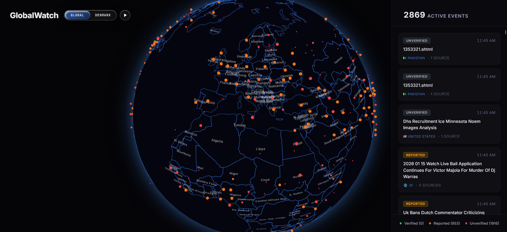
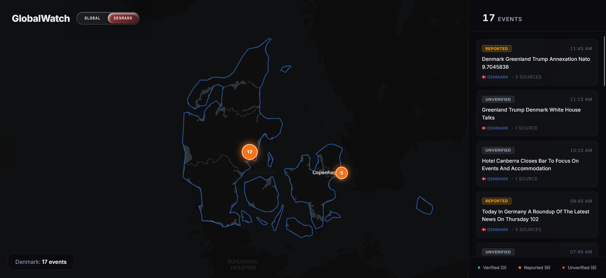
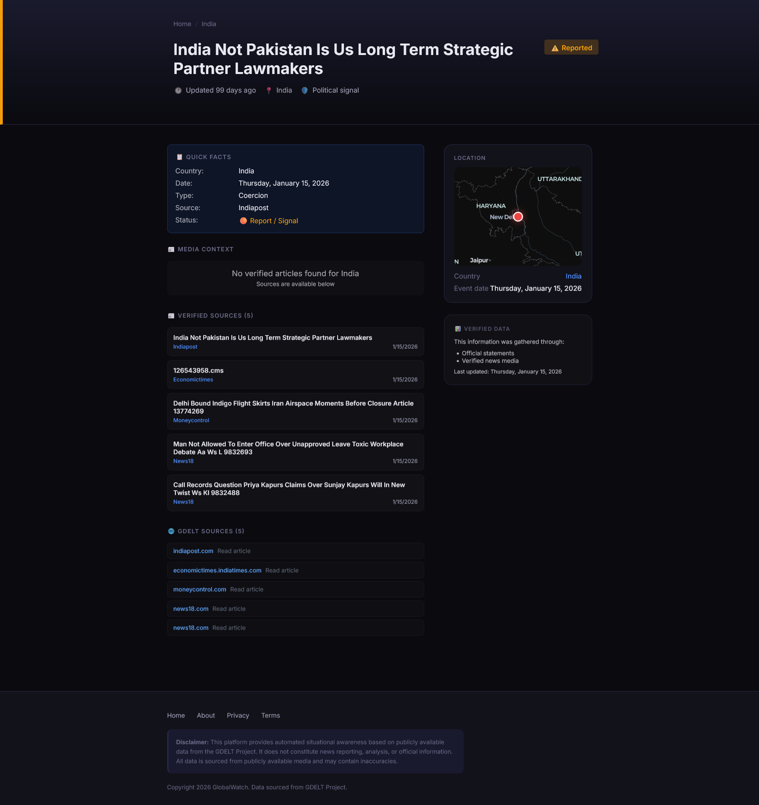

# GlobalWatch

GlobalWatch is an open-source situational awareness dashboard for monitoring geopolitical signals on an interactive globe.

It combines public event feeds, article metadata, lightweight verification signals, and a 3D map interface so users can scan where important global events are being reported.

> Important: GlobalWatch is not an official alerting system and does not replace professional journalism, emergency services, or government guidance. It is an exploratory OSINT tool built from public data that may be incomplete, delayed, duplicated, or wrong.

## What It Does

- Shows global geopolitical events on a full-screen 3D globe.
- Provides a Denmark-focused map view.
- Falls back to cached event data when SQLite has no fresh rows.
- Groups nearby events into map clusters.
- Displays event status as Verified, Reported, or Unverified.
- Provides event detail pages with sources, media context, map location, and metadata.
- Includes country and city pages for browsing regional activity.
- Supports a production Next.js build and Docker-based deployment.

## Screenshots

Homepage globe:



Denmark map with events:



Individual event page:



## Tech Stack

- Next.js 16 and React 19
- TypeScript
- Three.js and OrbitControls for the globe
- MapLibre via react-map-gl for the Denmark map
- SQLite through better-sqlite3
- GDELT, ACLED, RSS/news API ingestion scripts
- LibreTranslate support for local translation workflows

## How The App Works

GlobalWatch has three main layers:

1. Ingestion scripts collect raw public data from GDELT, RSS feeds, ACLED, and optional news APIs.
2. Processing code filters, scores, enriches, geocodes, clusters, and stores events.
3. The Next.js app serves normalized events to the globe, maps, sidebars, detail pages, and API routes.

The homepage reads from `/api/events`. That endpoint first checks SQLite and falls back to `data/events.json` when the database is empty, which keeps the demo usable for new clones.

More detail is in [docs/ARCHITECTURE.md](docs/ARCHITECTURE.md).

## Quick Start

Requirements are listed in [REQUIREMENTS.md](REQUIREMENTS.md).

Install dependencies:

```bash
npm install
```

Create local environment variables:

```bash
cp .env.example .env
```

Run the development server:

```bash
npm run dev
```

Open:

```text
http://localhost:3000
```

Build for production:

```bash
npm run build
npm run start
```

If you switch Node versions and see a `better-sqlite3` native module error, rebuild the native dependency:

```bash
npm rebuild better-sqlite3
```

## Environment Variables

Most features can run from cached public data. Some ingestion and enrichment scripts need API keys.

Copy `.env.example` to `.env` and fill in only the providers you plan to use:

```env
ACLED_EMAIL=
ACLED_PASSWORD=
NEWSDATA_API=
CURRENTS_API=
GNEWS_API=
MEDIASTACK_API=
WORLDNEWS_API=
SEARXNG_URL=http://localhost:8888
```

Never commit `.env`, tokens, database files, or generated logs.

## Useful Scripts

```bash
npm run dev      # Start local dev server
npm run build    # Build production bundle
npm run start    # Start production server
npm run lint     # Run ESLint
```

The `scripts/` directory contains ingestion, enrichment, migration, and debugging utilities. Some scripts require provider credentials or local data files.

## Project Structure

```text
src/
  app/
    api/events/          Event API routes
    event/[slug]/        Event detail pages
    country/[country]/   Country hub pages
    city/[city]/         City hub pages
    page.tsx             Main globe dashboard
  components/
    Globe/               Three.js globe
    DenmarkMap/          Denmark-focused map
    Sidebar/             Event list and status summary
  lib/
    db/                  SQLite setup and event normalization
    gdelt/               GDELT fetching, clustering, and cache store
    geo/                 Geocoding and location helpers
    ingestion/           Event generation and enrichment
    news/                News provider clients and verification helpers
    verify/              Filtering and country-code helpers
data/
  events.json            Cached demo/source event store
  docs/                  Provider notes and verification model docs
scripts/                 Operational ingestion and maintenance scripts
```

## Data Sources

GlobalWatch can use:

- GDELT Project
- ACLED
- RSS feeds
- NewsData.io
- GNews
- Mediastack
- WorldNewsAPI
- Currents API
- SearXNG for self-hosted search workflows

Each source has different licensing, quota, attribution, and reliability characteristics. Check provider terms before deploying a public instance.

## Responsible Use

GlobalWatch is designed to make public signals easier to inspect, not to declare ground truth.

Please:

- Treat generated event clusters as leads, not final conclusions.
- Click through to source material before sharing claims.
- Expect duplicated, noisy, or incorrectly geocoded data.
- Add provider attribution when required by source terms.
- Avoid using this app for emergency decision-making without human verification.

## Deployment

There is a Dockerfile for container deployment:

```bash
docker build -t globalwatch .
docker run -p 3000:3000 --env-file .env globalwatch
```

The production start script launches LibreTranslate, the cron worker, and the Next.js server. Review `start.sh` before deploying to make sure those services match your infrastructure.

## Contributing

Contributions are welcome. Good first areas:

- Improve event deduplication and clustering.
- Add stronger source attribution UI.
- Improve accessibility and mobile layout.
- Add provider-specific test fixtures.
- Reduce false positives in geocoding and verification.
- Add screenshots and deployment recipes.

See [CONTRIBUTING.md](CONTRIBUTING.md).

## Security

Do not publish credentials, tokens, generated databases, or logs. See [SECURITY.md](SECURITY.md).

If this repository has ever contained real credentials, rotate those credentials before making the repository public.

## License

GlobalWatch is available under the MIT License. See [LICENSE](LICENSE).
